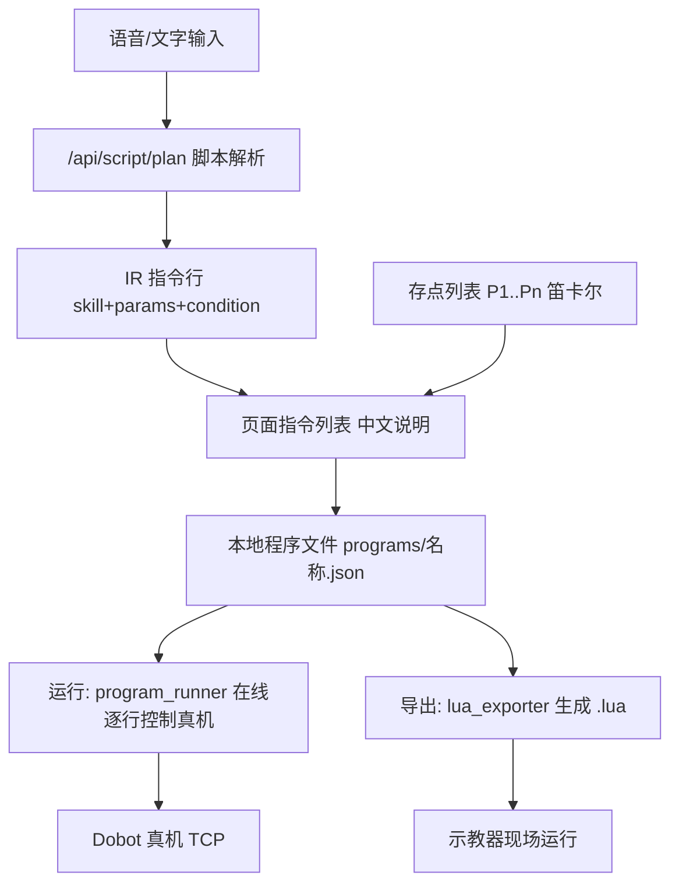
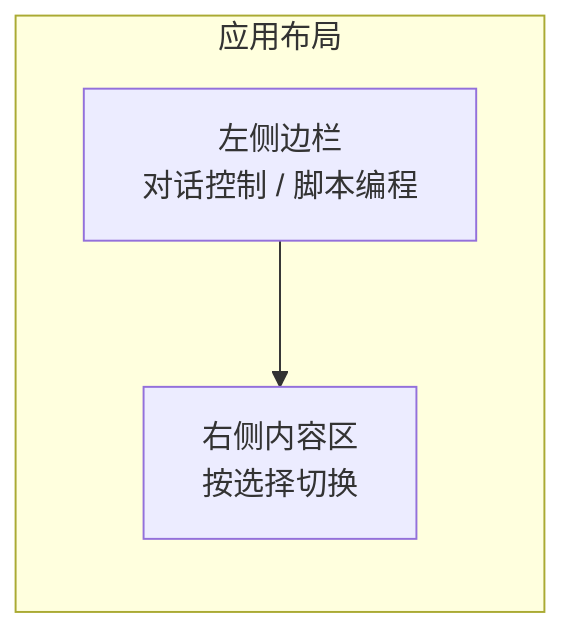

# 二期改造完整方案规划说明（脚本编程模式）

> 面向对象：你（项目负责人）与后续开发者。
> 目标：在不破坏一期"对话控制"的前提下，新增"脚本编程"模式——用语音/文字逐条生成可编辑的机器人指令程序，可在线运行（真机测试）、可本地存取、可一键导出越疆 Lua 脚本到示教器现场部署。

---

## 一、核心决策（关键思考点的答复）

你提出的关键问题：Python 程序转 Lua，是"编程时转"还是"导出时转"？

**结论：导出时转。** 编程时每行指令以结构化的"中间表示"（IR，即现有 `{skill, params}` 模型的扩展）存储与编辑，页面上只显示中文说明；只有点"导出 Lua"时才把整段程序翻译成 `.lua` 文本。

为什么这样最好用、最好实现：

1. 复用一期成熟链路。一期已有「中文 → `{skill, params}` JSON → 白名单执行器 → Dobot TCP」的完整通路（`robot_planner.py` → `executor.py` → `robot_session.py`）。脚本模式只是把"一条一执行"升级为"多条排成程序、可存可改可批量跑"。
2. 单一数据源。同一份 IR 既能在线跑（测试），又能导出 Lua（现场部署），两者永不冲突。
3. 解耦。页面显示与 Lua 语法分离；将来换机型/换语言只改导出器一个文件。

其它已确认决策：

- 运行范围：**在线运行 + 导出 Lua**。运行按钮通过现有 Python TCP 通道直连真机逐行执行（测试用）；导出按钮生成 `.lua` 拿到示教器现场跑。
- DI/DO 信号：**在线执行与 Lua 导出都支持**。
- 技术栈不变：Flask + 原生 JS（不引入框架），最大化复用，符合"代码结构越简单越好"。
- 坐标系：全程使用笛卡尔坐标。

---

## 二、整体数据流



---

## 三、数据模型

### 3.1 程序文件（本地 JSON，存于 `programs/<名称>.json`）

```json
{
  "name": "示例程序",
  "points": [
    {"id": "P1", "pose": [250.0, 0.0, 300.0, 180.0, 0.0, 0.0]},
    {"id": "P2", "pose": [250.0, 100.0, 300.0, 180.0, 0.0, 0.0]}
  ],
  "instructions": [
    {"skill": "set_speed", "params": {"speed_percent": 30}, "text": "设置速度为 30%", "condition": null},
    {"skill": "move_to_program_point", "params": {"point": "P1", "move_type": "movj"}, "text": "运动到 P1", "condition": null},
    {"skill": "move_to_program_point", "params": {"point": "P2", "move_type": "movl"}, "text": "当 DI2 为 ON 时，直线运动到 P2", "condition": {"di": 2, "state": "ON"}},
    {"skill": "set_do", "params": {"index": 1, "state": "ON"}, "text": "置 DO1 为 ON", "condition": null}
  ]
}
```

- 存点 `P1..Pn` 为**程序内局部点**（区别于一期全局 `positions.json`），统一笛卡尔坐标，从机械臂当前位姿采集。
- 每条指令可选挂 `condition`（DI 触发条件），表达"当 DIx 为 ON/OFF 时才执行本行"。
- 文件名自定义、不可重复；支持多文件、导入、导出。

### 3.2 新增 IR 指令类型（注册到 `skill_registry.json`）

| Skill | 含义 | 参数 |
|-------|------|------|
| `move_to_program_point` | 运动到程序点 Pn | `point`、`move_type`(movj/movl)、`speed_percent` |
| `set_do` | 置数字输出 DOx | `index`、`state`(ON/OFF) |
| `wait_di` | 等待数字输入 DIx 达到状态 | `index`、`state`、`timeout_seconds` |

复用一期已有：`set_speed`、`wait`，以及（作为兜底）`move_relative_linear` 等。

---

## 四、后端改造

### 4.1 底层 IO 能力（`robot_session.py`）

- `read_di(index)`：调用 `dashboard.DI(index)` 读取数字输入，返回 0/1。
- `set_do(index, state)`：调用 `dashboard.DOInstant(index, 1/0)` 立即置位（在线执行用）。
- `get_do(index)`：调用 `dashboard.GetDO(index)`。

### 4.2 新 Skill（`skills/` 目录，遵循 `run(session, params, context)` 约定）

- `skills/move_to_program_point.py`：从 `context["program_points"]` 取 Pn 的笛卡尔坐标，调 `session.movj/movl`。
- `skills/set_do.py`、`skills/wait_di.py`。
- 在 `skills/__init__.py` 注册到 `SKILL_HANDLERS`。

### 4.3 脚本解析器（`script_parser.py`）

把一句话翻译为一条或多条 IR。识别：条件前缀（当 DIx 为 ON 时…）、运动到 Pn、从 Px 到 Py、置 DOx、等待 DIx、设置速度、等待秒数；无法识别时回落到一期 `plan_from_text`。每条 IR 自动生成中文 `text` 说明。

### 4.4 在线顺序执行器（`program_runner.py`）

输入整段程序 IR：逐行执行；遇 `condition` 先读 DI 判断（满足才执行该行）；运动行从程序点解析坐标后调底层运动。复用 `robot_runner` 的连接/保活 session 模式。

### 4.5 Lua 导出器（`lua_exporter.py`）

依据 `1.cobot用户手册（脚本编程部分.md）` 与 `lua_commands.md` 映射表生成：

- 程序点 → `P1 = {pose={x,y,z,rx,ry,rz}}`
- `move_to_program_point` → `MovJ(P1,{v=..})` / `MovL(P1,{v=..,cp=..})`
- `set_speed` → `SpeedFactor(ratio)`
- `wait`(秒) → `Sleep`/`Wait(ms)`；`wait_di` → `Wait("DI(x) == ON")`
- `set_do` → `DO(x, ON|OFF)`
- 带 `condition` 的行 → `if DI(x) == ON then ... end`

### 4.6 Flask 路由（`web_app.py`）

| 方法 路径 | 作用 |
|-----------|------|
| `POST /api/script/plan` | 一句话 → IR 指令列表 |
| `POST /api/capture-pose` | 读当前位姿（添加/修改当前点） |
| `GET /api/programs` | 列出本地程序 |
| `GET /api/programs/<name>` | 读取某程序 |
| `POST /api/programs/<name>` | 保存程序（重名校验） |
| `DELETE /api/programs/<name>` | 删除程序 |
| `POST /api/run-program` | 在线逐行运行整段程序 |
| `POST /api/export-lua` | 程序 → `.lua` 文本（前端下载） |

一期 `/api/plan`、`/api/run-once`、`/api/status` 等保持不变。

---

## 五、前端改造（页面布局设计）

### 5.1 整体布局



- 新增**左侧边栏**（仿 OpenClaw）：自上而下两项「对话控制」「脚本编程」。
- 右侧内容区按边栏切换：
  - **对话控制**：保持一期聊天页面完全不变。
  - **脚本编程**：顶部工具条 + 中部指令列表 + 右侧存点列表 + 底部输入框。

### 5.2 脚本编程页面分区

- 顶部工具条：程序选择下拉、程序名输入、`新建` `保存` `导入` `导出 Lua` `运行`。
- 中部指令列表：每行显示中文说明 + `上移` `下移` `删除`；带条件的行有标记。
- 右侧存点列表：`添加当前点`（记录当前笛卡尔位姿，自动编号 P1,P2…）、每点 `修改当前点` `删除`。
- 底部输入框：文字输入 + 麦克风（复用浏览器 Web Speech API）+ `插入指令`。

### 5.3 可实现的交互功能

- 语音/文字 → 解析 → 把中文说明作为一行（或多行）插入指令列表。
- 指令行排序、删除。
- 存点：添加/修改/删除当前点。
- 程序：新建、保存（文件名不可重复）、切换、导入、导出 JSON、导出 Lua。
- 运行：从上到下逐行在线执行，并显示结果。

---

## 六、已知问题与对策（对应你列出的疑问）

- **奇异点**：全程笛卡尔；大角度姿态变化优先 `movj`；存点来自真机示教，天然可达。
- **多运动指令平滑过渡**：导出 Lua 时用 `cp`（平滑过渡比例）/`r`（过渡半径）参数实现连续轨迹；在线测试为逐条阻塞执行（仅验证逻辑），现场以 Lua 为准。
- **能否执行多个运动指令**：程序即指令列表，天然支持多条顺序执行。

---

## 七、阶段拆分与任务清单

### 阶段 0：整理越疆 Lua5 可用指令白名单
- 从手册提取可用指令（MovJ/MovL/Arc/Circle/SpeedFactor/DO/DI/Wait/Sleep/cp/r/stopcond），形成 `lua_commands.md` 与 IR→Lua 映射表。

### 阶段 1：数据模型与 IR
- 定义程序文件 JSON 格式与程序点模型。
- 在 `skill_registry.json` 注册 `move_to_program_point`、`set_do`、`wait_di`。

### 阶段 2：后端底层 IO + 新 Skill
- `robot_session.py` 新增 `read_di`/`set_do`/`get_do`。
- 新增三个 skill 文件并在 `skills/__init__.py` 注册。

### 阶段 3：后端程序 CRUD / 捕获位姿 / 解析
- `script_parser.py`；`web_app.py` 新增上表所有路由；程序存于 `programs/`。

### 阶段 4：在线顺序执行器
- `program_runner.py`（含 DI 条件判断、程序点解析、session 保活）。

### 阶段 5：Lua 导出器
- `lua_exporter.py`（点定义 + 运动 + IO + 条件 + 平滑过渡参数）。

### 阶段 6：前端布局
- 改造 `templates/index.html` 增加边栏与内容区切换，保留原聊天页不变。

### 阶段 7：前端交互
- `app.js`/`app.css` 实现指令列表编辑、存点列表、语音插入、保存/导入/导出/运行。

### 阶段 8：联调与文档
- 真机联调测试，更新使用说明。
