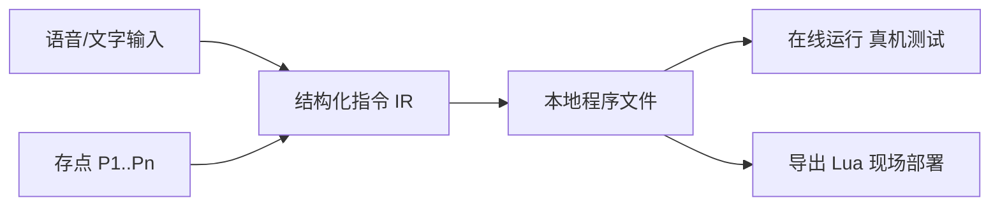

# COBOT + AI 应用 二期改造阶段计划（汇报版）

| 项目 | 内容 |
|------|------|
| 项目名称 | COBOT + AI 应用 · 二期（脚本编程模式） |
| 改造目标 | 在一期"语音/文字对话控制机械臂"基础上，新增"脚本编程"模式：用语音/文字逐条编写机器人程序，可本地存取、在线运行测试，并一键导出越疆 Lua 脚本到现场部署 |
| 技术栈 | Flask + 原生 JS（沿用一期，不引入新框架） |
| 适用机型 | 越疆六轴协作臂（Lua5 脚本编程） |

---

## 一、改造背景与目标

一期已实现"说一句话 → 机械臂执行一个动作"的对话控制。但工业现场存在两个痛点：

1. 现场不便携带 Python 环境，机械臂现场运行的是 Lua 脚本；
2. 实际作业需要把"多个动作"编成一段可复用、可保存的程序，并能根据 DI/DO 信号做条件控制。

二期目标：把"一次一条、即时执行"升级为"多条排成程序、可存可改可批量跑、可导出 Lua 现场部署"，同时保留语音/文字这一便捷输入方式。

### 核心设计思路（一句话）

每行指令以"结构化中间表示（IR）"保存，页面只显示中文说明；**编程时不转 Lua，导出时才转**。同一份程序既能在软件里在线运行测试，又能导出 `.lua` 到示教器现场运行。

---

## 二、总体方案概述

| 能力 | 说明 |
|------|------|
| 双模式界面 | 左侧边栏切换「对话控制」（一期，保持不变）/「脚本编程」（二期新增） |
| 语音/文字编程 | 说一句话生成一条中文指令，插入到程序列表 |
| 存点管理 | 把机械臂当前笛卡尔位置记录为 P1、P2…，支持修改/删除 |
| 条件控制 | 支持"当 DIx 为 ON 时执行该行"的信号触发 |
| 程序管理 | 本地多文件保存（名称不可重复）、导入、切换 |
| 在线运行 | 从上到下逐行控制真机执行，用于测试 |
| 导出 Lua | 一键生成符合越疆规范的 `.lua` 脚本下载 |

---

## 三、阶段划分与任务清单

共划分为 **8 个阶段 + 1 项方案文档**，建议按顺序推进（前一阶段是后一阶段的基础）。

### 阶段 0：整理可用 Lua 指令白名单
- 目标：确定导出 Lua 时只使用机型真正支持的指令。
- 任务：
  - 从《cobot 用户手册（脚本编程部分）》提取可用指令（运动 `MovJ/MovL/Arc/Circle`、速度 `SpeedFactor`、IO `DO/DI`、等待 `Wait/Sleep`、平滑过渡 `cp/r`、条件 `if DI()==ON`）；
  - 整理"软件指令 → Lua 指令"映射表，作为导出器依据。
- 交付物：`lua_commands.md`

### 阶段 1：数据模型与指令类型
- 目标：定义程序文件格式与新指令。
- 任务：
  - 定义程序文件 JSON 结构（程序名 + 存点列表 + 指令列表）；
  - 定义程序点模型 P1..Pn（笛卡尔坐标）；
  - 注册 3 个新指令类型：`move_to_program_point`（运动到程序点）、`set_do`（置 DO）、`wait_di`（等待 DI）。
- 交付物：`skill_registry.json`（新增指令）

### 阶段 2：后端底层 IO 与新动作
- 目标：让软件能读写机械臂信号、执行新指令。
- 任务：
  - 机械臂会话层新增：读 DI、置 DO、读 DO；
  - 实现 3 个新动作模块并注册到执行器。
- 交付物：`robot_session.py`（IO 能力）、`skills/move_to_program_point.py`、`skills/set_do.py`、`skills/wait_di.py`

### 阶段 3：后端解析与程序接口
- 目标：把"一句话"翻译成指令，并提供程序的存取接口。
- 任务：
  - 脚本解析器：识别"运动到 P1 / 从 P1 到 P2 / 置 DO1 为 ON / 等待 DI1 为 ON / 当 DIx 为 ON 时… / 设置速度 / 等待几秒"，无法识别时回落一期解析能力；
  - 新增接口：解析指令、读取当前位姿（存点用）、程序列表/读取/保存/删除、运行程序、导出 Lua。
- 交付物：`script_parser.py`、`web_app.py`（新增接口）、`programs/` 目录

### 阶段 4：在线顺序执行器
- 目标：把整段程序在真机上逐行跑出来。
- 任务：
  - 逐行执行；遇条件先读 DI 判断（满足才执行该行）；运动行解析程序点坐标后控制机械臂；
  - 复用一期连接/使能/会话保活机制。
- 交付物：`program_runner.py`

### 阶段 5：Lua 导出器
- 目标：把程序翻译成现场可用的 Lua 脚本。
- 任务：
  - 程序点 → Lua 点定义；
  - 各指令 → 对应 Lua 语句；
  - 带条件的行 → `if DI(x)==ON then … end`；
  - 运动行支持平滑过渡参数（`cp`）。
- 交付物：`lua_exporter.py`

### 阶段 6：前端页面布局
- 目标：搭好双模式界面框架。
- 任务：
  - 左侧边栏「对话控制 / 脚本编程」+ 右侧内容区切换；
  - 对话控制页保持一期完全不变；
  - 脚本编程页：顶部工具条 + 指令列表 + 存点列表 + 底部输入框。
- 交付物：`templates/index.html`、`static/css/app.css`

### 阶段 7：前端交互功能
- 目标：让用户真正能编程、能操作。
- 任务：
  - 语音/文字插入指令；指令行上移/下移/删除/编辑条件；
  - 存点：添加当前点、修改当前点、删除；
  - 程序：新建、保存（重名校验）、切换、导入；
  - 运行整段程序；导出 Lua 文件下载。
- 交付物：`static/js/app.js`

### 阶段 8：联调与文档
- 目标：整体走通并形成使用说明。
- 任务：
  - 软件层联调验证（解析、存取、导出等）；
  - 真机联调（存点、在线运行、DI/DO 读写）；
  - 更新使用说明。
- 交付物：`使用说明.md`（新增脚本编程章节）、`二期改造完整方案规划说明.md`

---

## 四、阶段进度一览

| 阶段 | 名称 | 主要交付物 | 状态 |
|------|------|-----------|------|
| 文档 | 完整方案规划 | `二期改造完整方案规划说明.md` | 已完成 |
| 0 | Lua 指令白名单 | `lua_commands.md` | 已完成 |
| 1 | 数据模型与指令类型 | `skill_registry.json` | 已完成 |
| 2 | 后端 IO 与新动作 | `robot_session.py`、3 个 skill | 已完成 |
| 3 | 解析与程序接口 | `script_parser.py`、`web_app.py` | 已完成 |
| 4 | 在线顺序执行器 | `program_runner.py` | 已完成 |
| 5 | Lua 导出器 | `lua_exporter.py` | 已完成 |
| 6 | 前端页面布局 | `index.html`、`app.css` | 已完成 |
| 7 | 前端交互功能 | `app.js` | 已完成 |
| 8 | 联调与文档 | `使用说明.md` | 软件层已完成；真机联调待现场 |

---

## 五、成果验证情况

软件层已通过验证（无需真机，使用接口测试）：

- 指令解析：中文一句话正确转为结构化指令（含 DI 条件、多点、IO）；
- 程序管理：保存 / 重名拦截 / 覆盖 / 读取 / 删除均正常；安全校验（非法文件名、路径穿越）已拦截；
- Lua 导出：生成的脚本含点定义、运动、IO、条件块，符合手册规范；
- 页面渲染与全部动作的参数校验通过。

待现场完成：真机联调（添加/修改存点、在线逐行运行、DI/DO 实际读写），需机械臂示教器切到 TCP/IP 远程控制。

---

## 六、已知问题与对策

| 问题 | 对策 |
|------|------|
| 奇异点 | 全程笛卡尔坐标；大角度姿态变化优先关节运动；存点取自真机示教，天然可达 |
| 多指令平滑过渡 | 导出 Lua 时使用平滑过渡参数（cp/r）实现连续轨迹；在线测试为逐条执行，仅验证逻辑，现场以 Lua 为准 |
| 多运动指令执行 | 程序即指令列表，天然支持多条顺序执行 |

---

## 七、后续建议

1. 现场接真机完成阶段 8 的真机联调；
2. 按现场实际信号定义，补充常用 DI/DO 话术；
3. 如需多机/多人监控，再评估实时通信方案（当前单机单臂场景 Flask 已足够）。
